<div align="center">

# ✈️ EasyGo — All-in-one Travel Booking Platform

**Hotels · Flights · Buses · Tour packages · Car rental — plus a fully controlled, self-hosted ad system.**

Laravel 13 · PHP 8.3 · React 18 · Redux Toolkit · Bootstrap 5 · Vite · Sanctum · MySQL / SQLite

</div>

---

## Contents

1. [Overview](#overview)
2. [Feature tour](#feature-tour)
3. [Screenshots](#screenshots)
4. [Tech stack](#tech-stack)
5. [Quick start](#quick-start)
6. [Demo accounts & test data](#demo-accounts--test-data)
7. [Project structure](#project-structure)
8. [Documentation](#documentation)
9. [Testing](#testing)
10. [Deployment](#deployment)
11. [Roadmap](#roadmap)

---

## Overview

EasyGo is a production-style online travel agency (OTA) in the spirit of Booking.com, Expedia,
ShareTrip and GoZayaan. Customers search, compare and book five kinds of travel products in one
place, pay with cards or Bangladeshi mobile wallets (bKash, Nagad, Rocket), and manage everything from
their account. Administrators run the whole platform — inventory, bookings, customers, reviews,
coupons, settings **and advertising** — from a dedicated back-office.

The **advertising module** works like Google AdMob but is entirely owned by the admin: upload a photo
or video, choose the zones (placements) where it should appear, decide **after how many seconds the
viewer may close/skip it**, optionally auto-close it, target guests/members and desktop/mobile, cap
frequency, set budgets and schedules, and watch impressions, clicks, CTR, skips and completions in
real time.

## Feature tour

### Customer site
| Area | Highlights |
|---|---|
| **Search** | Tabbed hero search for all 5 verticals, city autocomplete, shareable URL-based filters, sort, pagination, skeleton loaders |
| **Hotels** | Star/price/rating/amenity/property-type filters, date-aware availability (“sold out for your dates”), photo gallery + lightbox, room types with live inventory, map, policies, verified reviews with rating breakdown |
| **Flights** | Route/date/passengers/cabin search, airline/stops/refundable/price filters, sort by price, departure or duration, seats-left urgency |
| **Buses** | Operator/coach-type filters and an **interactive seat map** (2-2, 1-2… layouts) with real-time booked seats |
| **Tours** | Category & duration filters, discount pricing, day-by-day itinerary, inclusions/exclusions, spots-left per departure date |
| **Cars** | Pick-up city & dates, type/transmission/seats/with-driver filters, fleet availability |
| **Checkout** | 3-step flow, price breakdown (subtotal, coupon, service fee, VAT), coupon codes, traveller names, special requests, terms consent |
| **Payment** | Card, bKash, Nagad, Rocket (OTP flow) and **pay at property** for hotels; reservation hold countdown; pluggable gateway |
| **Account** | Dashboard, bookings (upcoming/past/cancelled), printable e-ticket/voucher, cancel with automatic refund calculation, wishlist, reviews, notifications, profile, avatar, password |
| **UX** | Responsive, **dark mode**, toast feedback, accessible markup, recently viewed, error boundaries, image fallbacks |

### Admin panel (`/admin`)
* **Dashboard** — revenue & bookings (30-day chart), bookings by service, KPIs with month-over-month growth, action alerts, top hotels, ad performance.
* **Inventory CRUD** — destinations, hotels (+ room types per hotel), flights, buses, tours, cars; image upload or URL, galleries, amenity checklists, itinerary builder.
* **Bookings** — filter/search, detail view with payments, confirm, mark paid/completed, cancel & refund, **CSV export**.
* **Customers** — users (roles, block/unblock, password reset), review moderation, support inbox with e-mail replies, newsletter subscribers (CSV export).
* **Marketing** — coupons (percent/fixed, caps, minimum spend, per-service, per-user & total limits, validity window).
* **Settings** — branding, hero content, currency, tax & service fee, hold time, pay-at-property, auto-approve reviews, global ad kill-switch, contact & social links.

### Advertising system
* **Zones** — 11 predefined placements (home, search results top/in-feed/sidebar, detail sidebar, checkout, account, footer, global interstitial, booking-confirmed interstitial); admins can add more.
* **Creatives** — image (JPG/PNG/WebP/GIF/SVG) or video (MP4/WebM/OGG) up to 50 MB, drag-and-drop upload with progress, or external URL; optional poster, headline, CTA button and click-through URL.
* **Close rules** — closable or not, *“You can skip in N s”* countdown (0–60 s, presets), auto-close timer with progress bar.
* **Delivery** — audience (everyone/guests/members), device (desktop/mobile), weighted rotation, per-viewer daily frequency cap, impression/click budgets, start/end schedule, pause/resume, duplicate.
* **Analytics** — viewable impressions (IntersectionObserver), clicks via tracking redirect, skips, closes, video completions, CTR, unique viewers, daily trend, by zone, by device.

See **[docs/ADVERTISING.md](docs/ADVERTISING.md)** for the full guide.

## Screenshots

> Captured from the running app in an offline sandbox, so stock photos show the built-in placeholder image.

| Home | Hotel search | Hotel details |
|---|---|---|
| 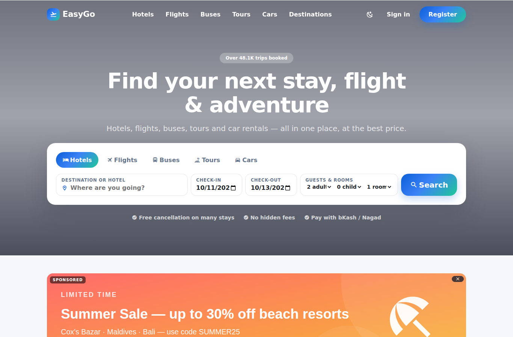 | 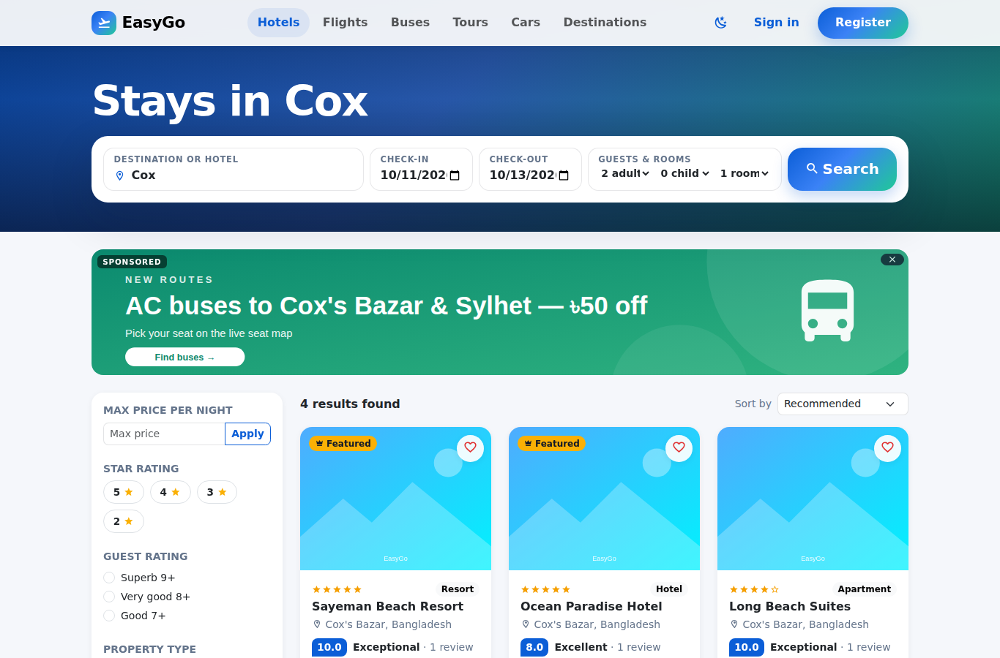 | 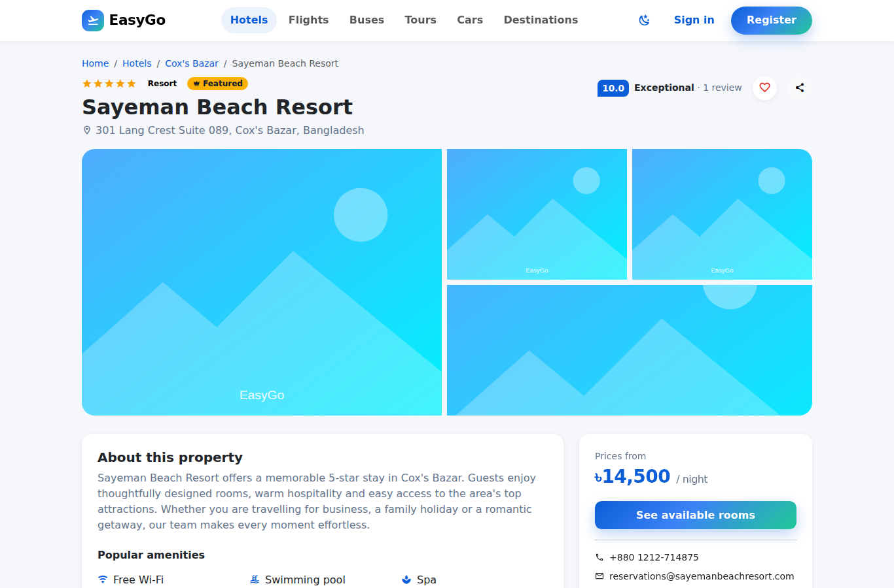 |
| **Flight results** | **Bus seat map** | **Checkout** |
| 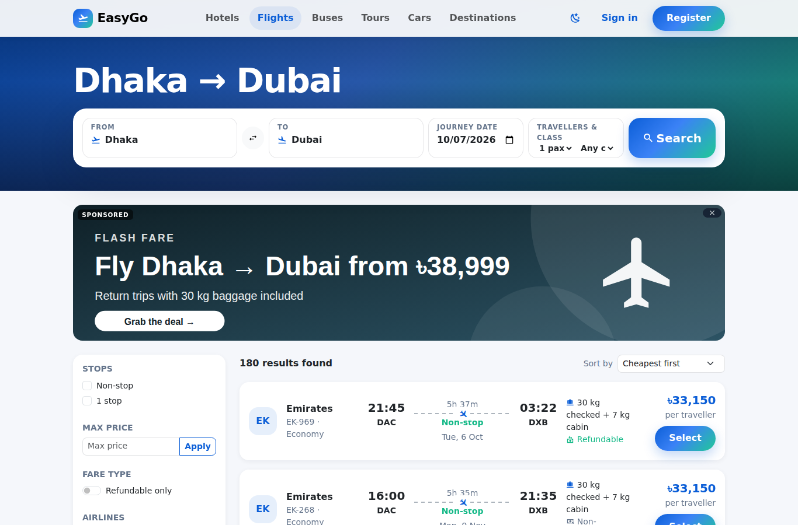 | 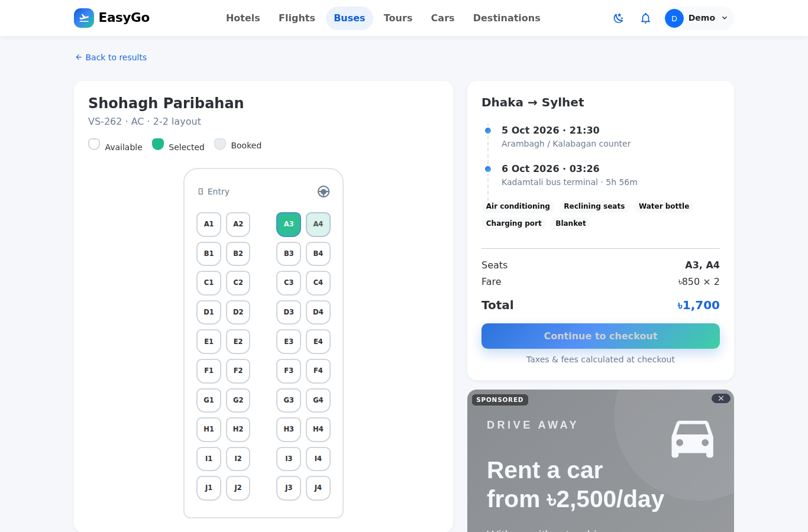 | 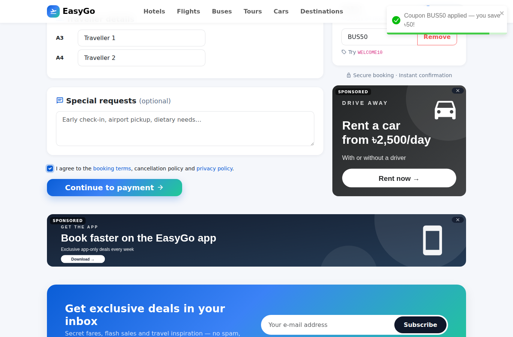 |
| **Payment** | **E-ticket** | **Interstitial ad (mobile)** |
| 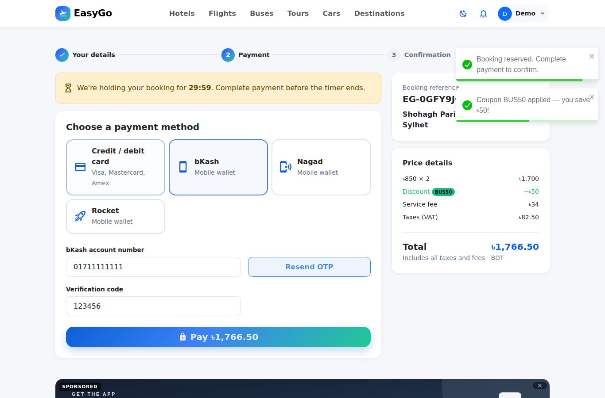 | 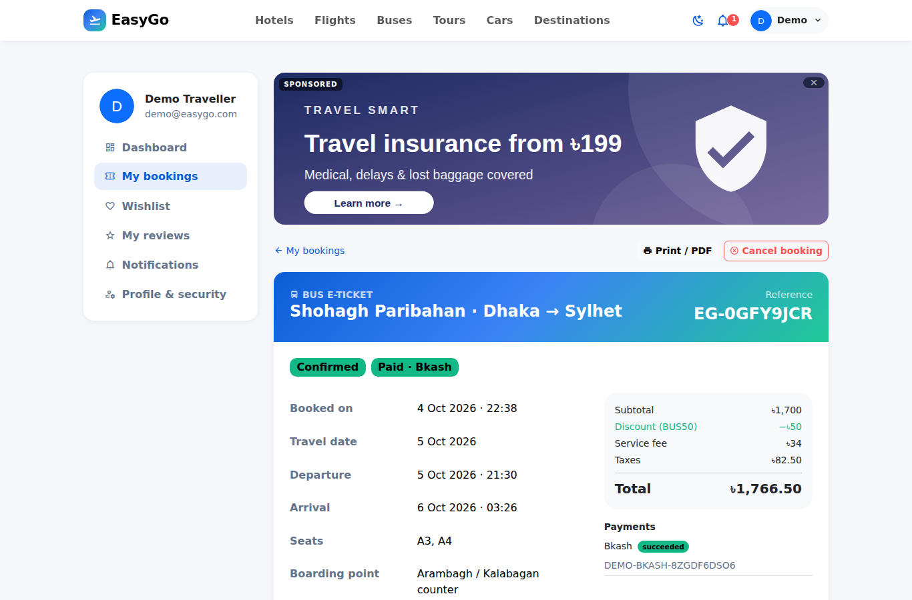 | 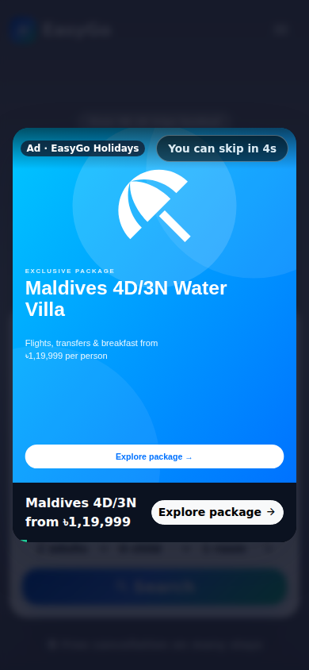 |
| **Admin dashboard** | **Ads manager** | **Ad analytics** |
| 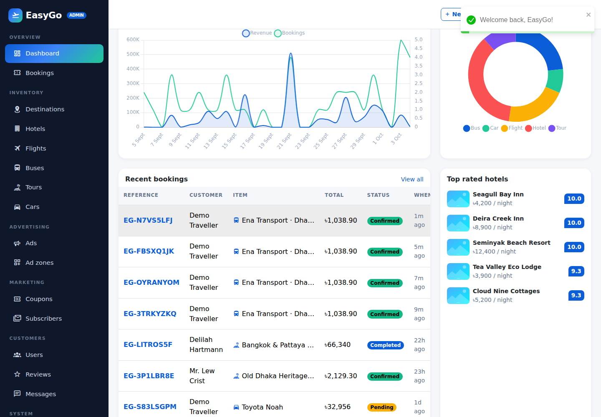 | 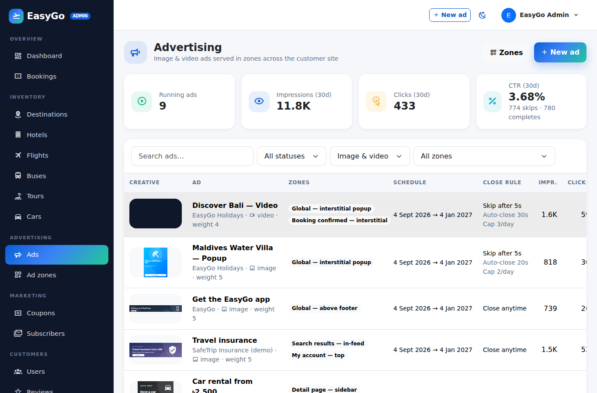 | 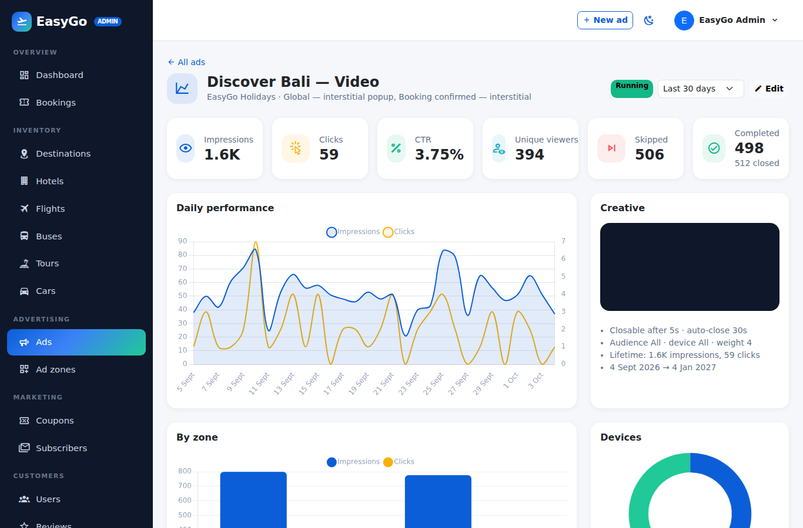 |
| **Create ad** | **Edit hotel** | **Dark mode** |
| 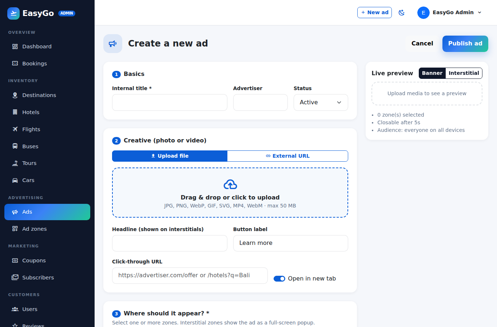 | 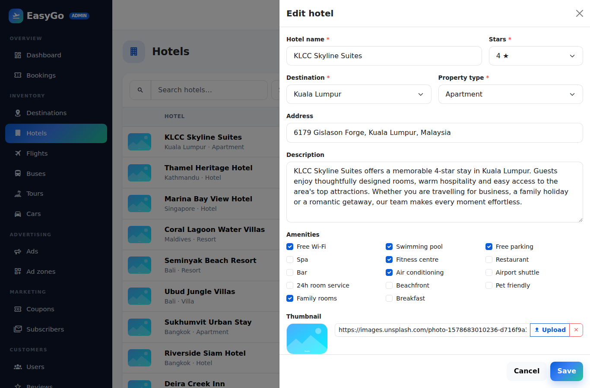 | 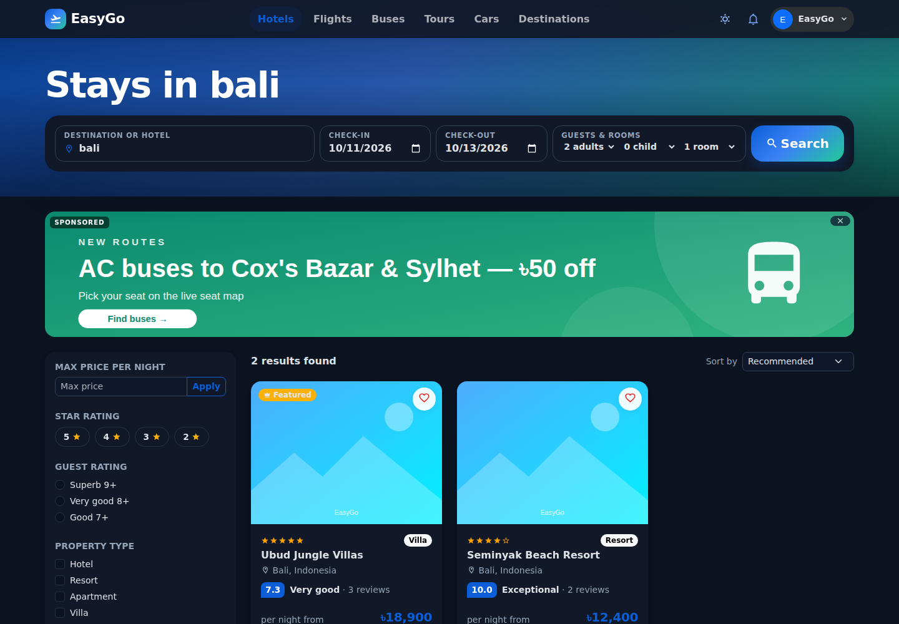 |

## Tech stack

| Layer | Technology |
|---|---|
| Backend | Laravel 13 (PHP 8.3), Eloquent ORM, Laravel Sanctum (token auth), Notifications (mail + database), Scheduler, Queues |
| Frontend | React 18 SPA, React Router 6, Redux Toolkit, Axios, Bootstrap 5.3 (SCSS), Material Design Icons, Chart.js, React-Toastify |
| Build | Vite 8 + `laravel-vite-plugin`, code-split admin bundle |
| Database | MySQL 8 / MariaDB (production), SQLite (development & tests), PostgreSQL compatible |
| Quality | PHPUnit (45 tests / 227 assertions), Laravel Pint, GitHub Actions CI, Playwright smoke test |
| Ops | Docker (PHP-FPM + Nginx + MySQL + scheduler + queue worker), docker-compose |

This continues the repository's original stack (Laravel + React + Redux + Axios + Bootstrap) on current, supported versions.

## Quick start

**Requirements:** PHP 8.3+ (pdo_sqlite or pdo_mysql, mbstring, intl, fileinfo), Composer 2, Node 20+.

```bash
cd EasyGo.com
composer setup        # install deps, .env, key, migrate + seed demo data, storage link, build assets
composer serve        # http://127.0.0.1:8000  (PHP server with 64 MB upload limit for ad videos)
```

For development with hot reload and the scheduler:

```bash
composer dev          # PHP server + scheduler + Vite dev server
```

<details>
<summary>Manual steps</summary>

```bash
cp .env.example .env
composer install && npm install
php artisan key:generate
touch database/database.sqlite          # or configure DB_* for MySQL in .env
php artisan migrate:fresh --seed
php artisan storage:link
npm run build                            # or: npm run dev
composer serve
php artisan schedule:work                # expires unpaid holds & completes past trips
```
</details>

Using MySQL instead of SQLite: set `DB_CONNECTION=mysql` and `DB_HOST/DB_PORT/DB_DATABASE/DB_USERNAME/DB_PASSWORD` in `.env`.

## Demo accounts & test data

| Role | E-mail | Password |
|---|---|---|
| Administrator | `admin@easygo.com` | `password123` |
| Customer | `demo@easygo.com` | `password123` |

> ⚠️ Change or remove these accounts before going live.

* **Coupons:** `WELCOME10`, `SUMMER25` (hotels), `FLY500` (flights), `BUS50`, `TOUR15`, `DRIVE20`
* **Demo card:** any 16-digit number succeeds; numbers ending in `0002` are declined.
* **Wallets:** any 11-digit number + any 6-digit OTP (`000000` fails).
* Seed data: 12 destinations, 22 hotels / 74 room types, ~3,960 flights and ~1,890 bus trips over 45 days, 11 tours, 24 cars, 90 historical bookings, ~160 reviews, 9 ads in 11 zones and 30 days of ad analytics.

## Project structure

```
EasyGo.com/
├── app/
│   ├── Http/Controllers/Api/         # public + customer REST controllers
│   ├── Http/Controllers/Api/Admin/   # back-office controllers (CrudController base)
│   ├── Http/Middleware/              # admin & active-account guards
│   ├── Models/                       # Eloquent models (+ Concerns: media, slugs, reviews)
│   ├── Notifications/                # booking confirmed/cancelled, welcome, contact reply
│   └── Services/                     # BookingService, PricingService, AdService, Payments/*
├── database/migrations | seeders | factories
├── resources/js/
│   ├── api/  store/  hooks/  utils/  # Axios client, Redux slices, hooks, formatters
│   ├── components/                   # layout, common UI, search, cards, ads, reviews
│   ├── pages/                        # customer pages (+ auth/, account/)
│   └── admin/                        # lazily-loaded admin app (resources config + pages)
├── resources/scss/app.scss           # design system (Bootstrap theme, dark mode)
├── routes/api.php | web.php | console.php
├── tests/Feature | Unit
├── docs/                             # SRS, architecture, diagrams, API, guides
├── docker/  Dockerfile  docker-compose.yml
└── server.php                        # dev router with raised upload limits
```

## Documentation

| Document | Description |
|---|---|
| [docs/SRS.md](docs/SRS.md) | Software Requirements Specification (IEEE 830 style) |
| [docs/ARCHITECTURE.md](docs/ARCHITECTURE.md) | System architecture, layers, components, design decisions |
| [docs/DIAGRAMS.md](docs/DIAGRAMS.md) | Use-case, DFD, sequence, activity, state and class diagrams (Mermaid) |
| [docs/DATABASE.md](docs/DATABASE.md) | ER diagram and data dictionary |
| [docs/API.md](docs/API.md) | REST API reference |
| [docs/ADVERTISING.md](docs/ADVERTISING.md) | Ad system: zones, creatives, rules, tracking, integration |
| [docs/USER_GUIDE.md](docs/USER_GUIDE.md) | Customer manual |
| [docs/ADMIN_GUIDE.md](docs/ADMIN_GUIDE.md) | Administrator manual |
| [docs/DEPLOYMENT.md](docs/DEPLOYMENT.md) | Local, Docker and production deployment |
| [docs/TESTING.md](docs/TESTING.md) | Test strategy and test cases |

## Testing

```bash
php artisan test          # 45 tests, 227 assertions
vendor/bin/pint --test    # code style
npm run build             # frontend compiles
```

CI runs all three on every push and pull request (`.github/workflows/ci.yml`).

## Deployment

```bash
cp .env.example .env && php artisan key:generate --show   # put APP_KEY into .env
docker compose up -d --build                              # http://localhost:8080
```

Production checklist, Nginx/PHP-FPM configuration, cron & queue setup and payment-gateway integration: **[docs/DEPLOYMENT.md](docs/DEPLOYMENT.md)**.

## Roadmap

* Real payment gateway adapters (SSLCommerz, bKash PGW, Stripe) behind the existing `PaymentGateway` interface
* Partner (hotel/operator) self-service portal
* Round-trip & multi-city flights, GDS/NDC integration
* Multi-language (Bangla/English) and multi-currency display
* Push notifications & PWA offline mode

## License

Released under the [MIT License](../LICENSE).
