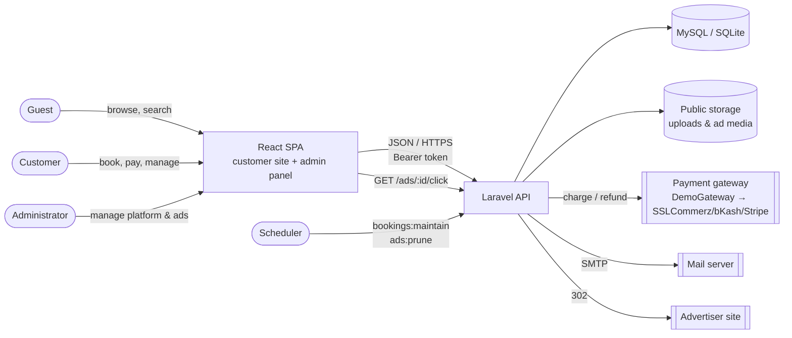
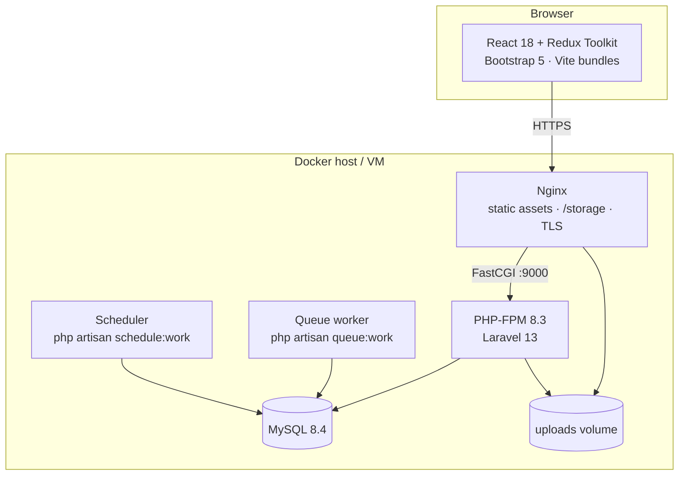
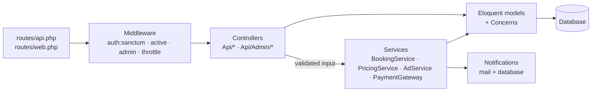
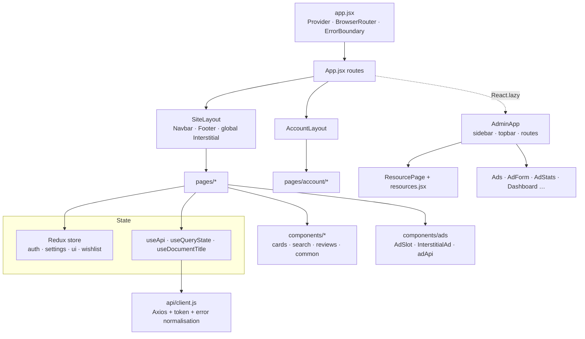
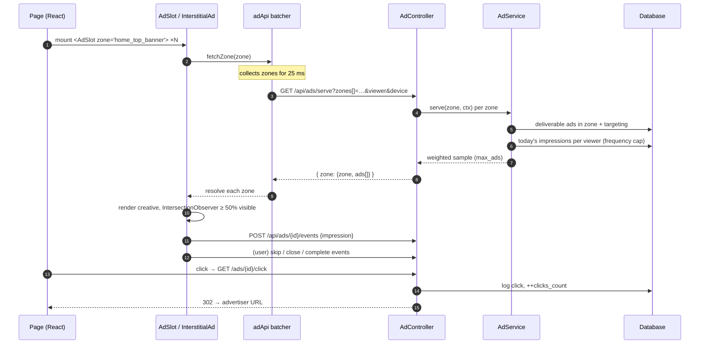

# Architecture

EasyGo is a **Laravel REST API + React single-page application** served from one Laravel project.
Laravel renders a single Blade shell (`resources/views/app.blade.php`); React Router handles every
page of both the customer site and the admin panel.

## 1. System context

## 2. Containers / deployment

## 3. Backend layers

| Layer | Responsibility | Key files |
|---|---|---|
| Routes | URL → controller mapping, throttling | `routes/api.php`, `routes/web.php`, `routes/console.php` |
| Middleware | Authentication (Sanctum), blocked-account check, admin role | `EnsureUserIsActive`, `EnsureUserIsAdmin` |
| Controllers | HTTP concerns: validation, authorization, response shaping | `app/Http/Controllers/Api/**` |
| Services | Business rules independent of HTTP | `BookingService`, `PricingService`, `AdService`, `Payments/*` |
| Models | Persistence, relations, scopes, small domain helpers | `app/Models/**` |
| Notifications | E-mail + in-app messages | `app/Notifications/**` |

### 3.1 Notable design decisions
* **Polymorphic bookings.** `bookings.bookable_type/id` point at `room_type`, `flight`, `bus`, `tour` or `car`
  (short names enforced via `Relation::enforceMorphMap`). One booking table, one checkout and one account UI
  serve all verticals; vertical-specific data lives in the JSON `details` column. Item name and image are
  snapshotted so history survives inventory edits.
* **Single booking pipeline.** `BookingService::prepare()` normalises input per vertical (dates, seats,
  passengers) and checks availability; `quote()`, `create()`, `pay()`, `cancel()`, `refundAmount()` and
  `maintain()` are shared. `create()` runs in a transaction with `lockForUpdate()` on the inventory row.
* **Pricing in one place.** `PricingService::breakdown()` produces subtotal, discount, service fee, tax and
  total from settings and coupons — used by both quote and booking creation, so the price shown is the price charged.
* **Payment adapter.** `PaymentGateway` interface with `DemoGateway` bound in `AppServiceProvider`;
  swapping in a real provider requires no change to controllers or the SPA.
* **Generic admin CRUD.** `Admin\CrudController` implements list/search/filter/sort/paginate/create/update/delete;
  each resource controller only declares its model, rules and hooks. The React side mirrors this with a
  declarative `admin/resources.jsx` consumed by one `<ResourcePage>` component.
* **Denormalised aggregates** (`avg_rating`, `reviews_count`, `min_price`, `impressions_count`,
  `clicks_count`) keep listings and ad budget checks fast; model events keep them in sync.
* **Timezone.** All timestamps are stored and rendered in `APP_TIMEZONE` (default `Asia/Dhaka`) — a flight
  departing 07:00 local shows as 07:00 to every viewer worldwide.

## 4. Frontend architecture

* **Global state** (Redux Toolkit): signed-in user, public settings, UI theme/sidebar, wishlist keys.
* **Server state**: fetched per page with the `useApi` hook (stale-response protection, reload).
* **URL state**: search filters live in the query string via `useQueryState` (shareable results).
* **Code splitting**: the admin app and Chart.js are separate chunks.
* **Design system**: `resources/scss/app.scss` themes Bootstrap (brand gradient, radii, typography) and
  implements dark mode via `[data-bs-theme="dark"]`.

## 5. Ad delivery architecture

Details: [ADVERTISING.md](ADVERTISING.md).

## 6. Security model

| Concern | Mechanism |
|---|---|
| Authentication | Sanctum personal access tokens (Bearer), expiring 1 day / 30 days |
| Authorization | `admin` middleware for back-office; ownership checks (`authorizeOwner`) on bookings |
| Account state | `active` middleware rejects blocked users and revokes the token |
| Input | Laravel validation on every endpoint; whitelisted sort columns; `$fillable` mass assignment |
| Abuse | Named and per-route rate limiters |
| Uploads | MIME validation, size limits, stored on the public disk under generated names |
| Privacy | Hashed IPs for ad events; anonymous viewer ids; no full card data |
| Transport | HTTPS in production; security headers in the provided Nginx config |

## 7. Scheduled jobs

| Command | Schedule | Purpose |
|---|---|---|
| `bookings:maintain` | every 5 minutes | Cancel unpaid holds older than `booking_hold_minutes`; mark past confirmed bookings completed |
| `ads:prune --days=180` | daily | Delete raw ad events older than 180 days |

## 8. Extending the system

* **New payment provider** — implement `PaymentGateway`, bind it in `AppServiceProvider::register()`.
* **New ad zone** — create it in *Admin → Ad zones*, then render `<AdSlot zone="your_key" />` (or `<InterstitialAd zone="…" />`) where it should appear.
* **New vertical** — add a model + migration, register it in the morph map, add a `prepareXxx()` method to `BookingService`, a public controller, an admin resource config and pages.
