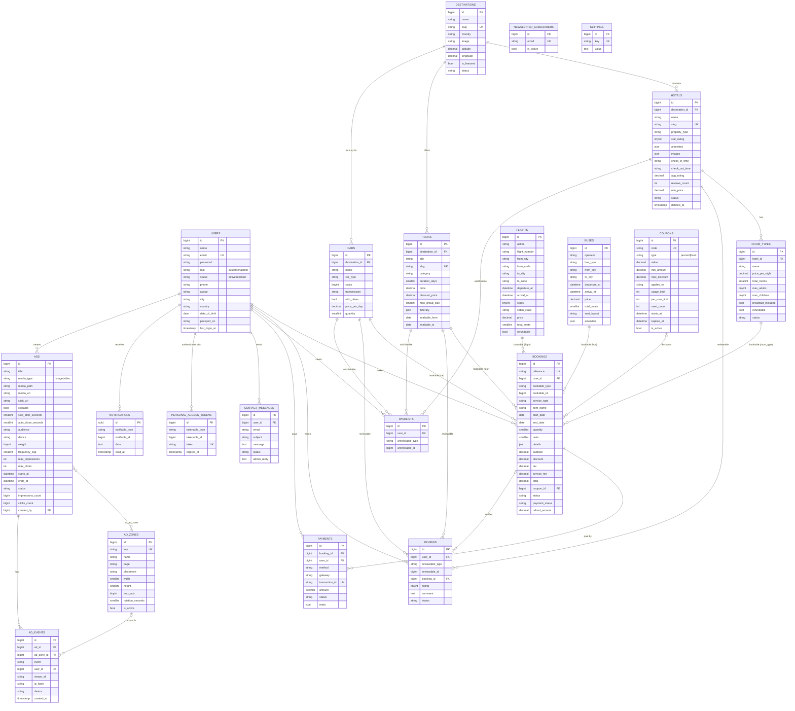

# Database Design

Migrations: `database/migrations/`. Engine-agnostic (MySQL/MariaDB, PostgreSQL, SQLite).
Money columns are `DECIMAL(12,2)`; JSON columns hold arrays/objects; timestamps use `APP_TIMEZONE`.

## 1. Entity–relationship diagram

## 2. Polymorphic type names

`Relation::enforceMorphMap` stores short, stable names in `*_type` columns:

| Value | Model |
|---|---|
| `user` | `App\Models\User` |
| `hotel` | `App\Models\Hotel` |
| `room_type` | `App\Models\RoomType` |
| `flight` | `App\Models\Flight` |
| `bus` | `App\Models\Bus` |
| `tour` | `App\Models\Tour` |
| `car` | `App\Models\Car` |
| `ad` | `App\Models\Ad` |

## 3. Data dictionary (key tables)

### bookings
| Column | Type | Notes |
|---|---|---|
| reference | varchar(20) unique | `EG-` + 8 random uppercase chars; used in URLs |
| bookable_type / bookable_id | morph | Inventory item (see §2) |
| service_type | varchar(20) | `hotel`, `flight`, `bus`, `tour`, `car` |
| item_name / item_image | varchar | Snapshot at booking time |
| start_date / end_date | date | Check-in/out, pick-up/drop-off, travel date (end null for flight/bus) |
| quantity | smallint | Rooms, passengers, seats, travellers or cars |
| units | smallint | Nights (hotel) or days (car); 1 otherwise |
| details | json | e.g. `{hotel_id, room_name, check_in_time}`, `{seats:[…], boarding_point}`, `{passengers:[{name, passport}]}` |
| unit_price … total | decimal(12,2) | Price breakdown (see PricingService) |
| status | varchar(20) | `pending` → `confirmed` → `completed`, or `cancelled` |
| payment_status | varchar(20) | `unpaid`, `paid`, `refunded` |
| refund_amount | decimal | Amount returned on cancellation |

### ads
| Column | Type | Notes |
|---|---|---|
| media_type | varchar(10) | `image` or `video` (detected from uploaded MIME type) |
| media_path / media_url | varchar | Uploaded file on the public disk **or** external URL |
| closable | bool | Viewer may dismiss the ad |
| skip_after_seconds | smallint | Delay before the close/skip button activates (0 = immediately) |
| auto_close_seconds | smallint null | Automatic dismissal; forced to 15 s for non-closable ads |
| audience | varchar | `all`, `guest`, `auth` |
| device | varchar | `all`, `desktop`, `mobile` |
| weight | tinyint | 1–10, weighted random rotation |
| frequency_cap | smallint null | Max impressions per viewer per day |
| max_impressions / max_clicks | int null | Lifetime budgets |
| impressions_count / clicks_count | bigint | Denormalised counters (budget checks, list view) |

### ad_events
| Column | Notes |
|---|---|
| event | `impression`, `click`, `skip`, `close`, `complete` |
| viewer_id | Anonymous browser id from localStorage (frequency capping, unique viewers) |
| ip_hash | `sha256(ip + APP_KEY)` — raw IPs are never stored |
| Indexes | `(ad_id, event, created_at)` for analytics, `(viewer_id, ad_id, event)` for frequency caps |

### settings (key/value)
`site_name`, `site_tagline`, `currency`, `currency_symbol`, `tax_rate`, `service_fee_percent`,
`booking_hold_minutes`, `pay_at_property_enabled`, `auto_approve_reviews`, `ads_enabled`, `hero_*`,
`about_text`, `contact_*`, social URLs. Cached forever and invalidated on save.

## 4. Integrity & concurrency
* Foreign keys cascade on delete for owned data (rooms of a hotel, bookings of a user) and null-out for optional links (coupon, booking on review).
* Booking creation locks the inventory row (`SELECT … FOR UPDATE`) inside a transaction and re-checks availability.
* Unique constraints: one review per user per item; one wishlist entry per user per item; unique codes/slugs/references.
* Soft deletes on hotels, tours and cars keep historical bookings intact.
