# UML & Analysis Diagrams

All diagrams are written in [Mermaid](https://mermaid.js.org/) and render directly on GitHub.

1. [Use-case diagram](#1-use-case-diagram)
2. [Data-flow diagrams (DFD level 0 and 1)](#2-data-flow-diagrams)
3. [Class diagram (domain model)](#3-class-diagram)
4. [Sequence — search to confirmed booking](#4-sequence--search-to-confirmed-booking)
5. [Sequence — cancellation & refund](#5-sequence--cancellation--refund)
6. [Sequence — admin uploads an ad](#6-sequence--admin-uploads-a-video-ad)
7. [Activity — checkout](#7-activity--checkout)
8. [Activity — interstitial ad lifecycle](#8-activity--interstitial-ad-lifecycle)
9. [State machine — booking](#9-state-machine--booking)
10. [State machine — ad delivery state](#10-state-machine--ad-delivery-state)
11. [Component diagram](#11-component-diagram)

ER diagram: see [DATABASE.md](DATABASE.md).

---

## 1. Use-case diagram

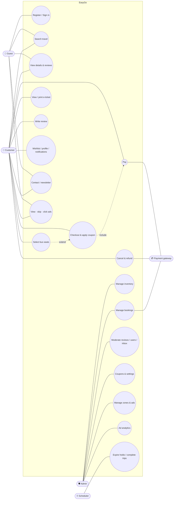

## 2. Data-flow diagrams

### Level 0 (context)

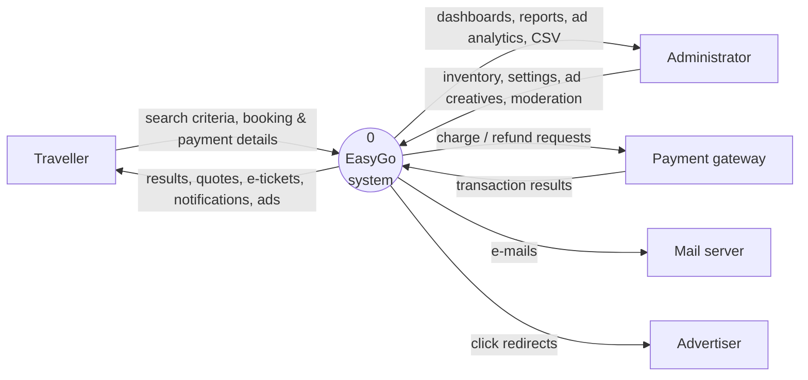

### Level 1

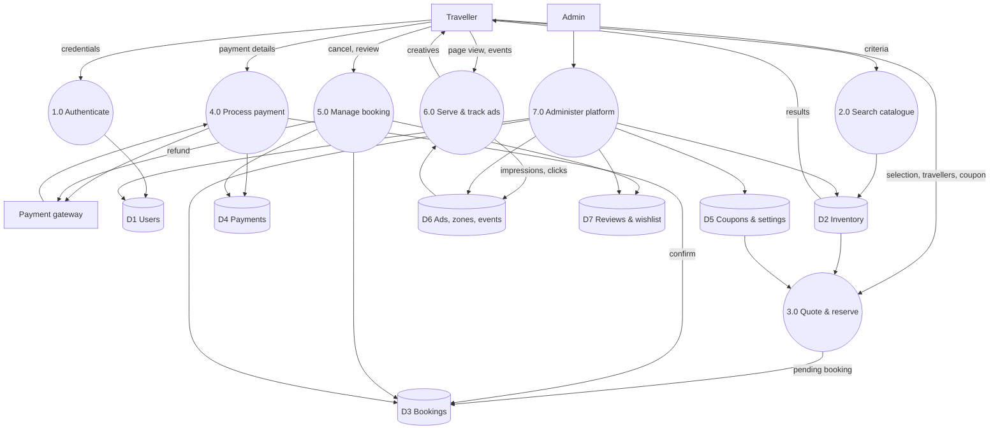

## 3. Class diagram

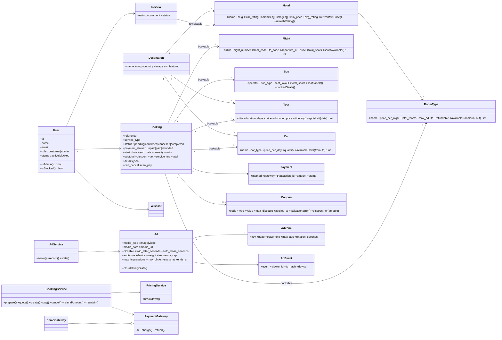

## 4. Sequence — search to confirmed booking

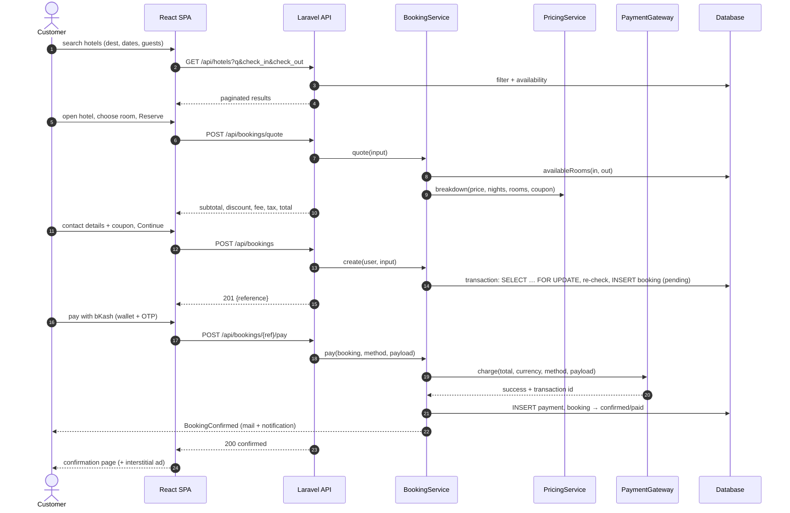

## 5. Sequence — cancellation & refund

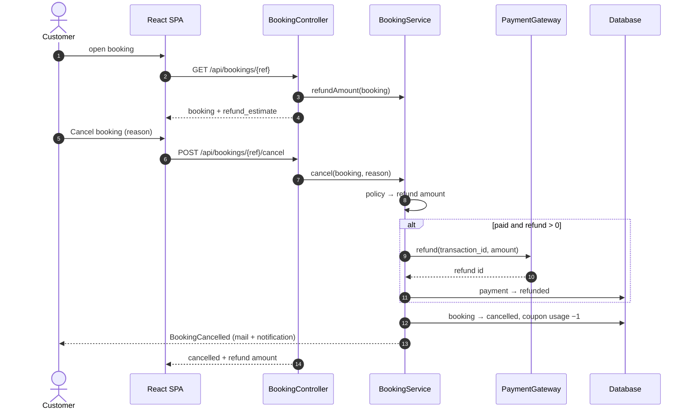

## 6. Sequence — admin uploads a video ad

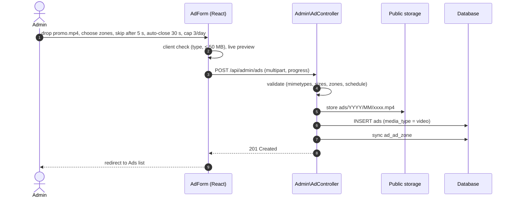

## 7. Activity — checkout

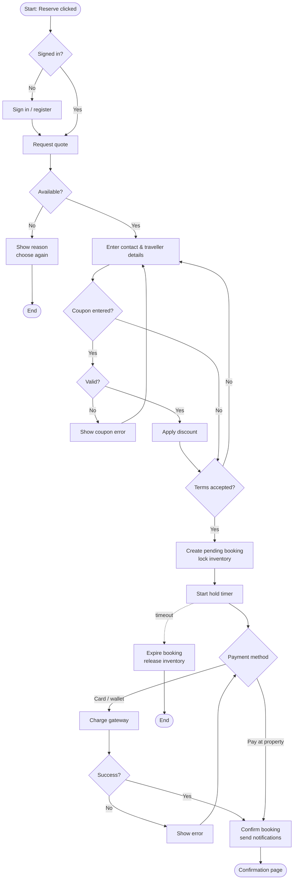

## 8. Activity — interstitial ad lifecycle

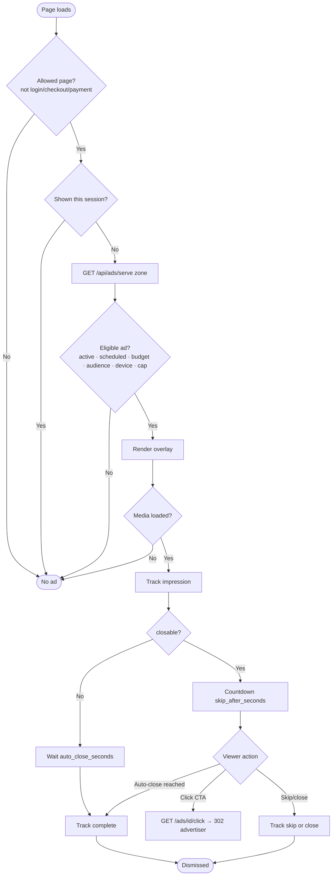

## 9. State machine — booking

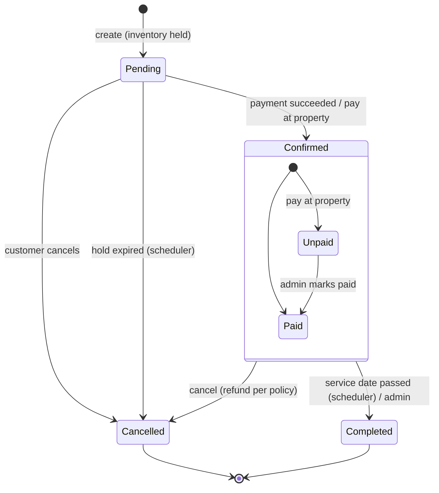

## 10. State machine — ad delivery state

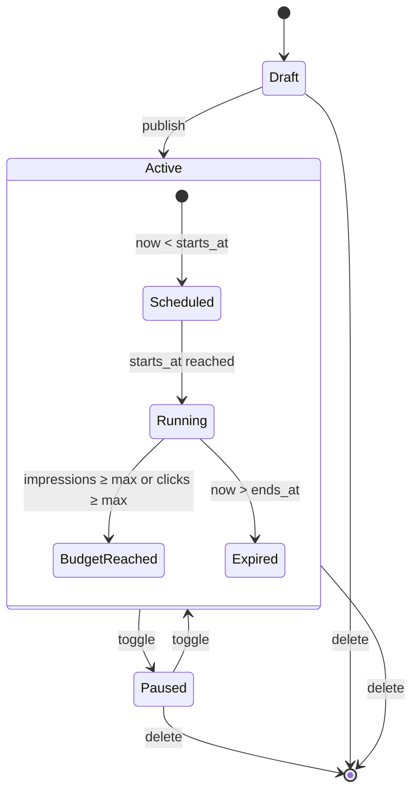

## 11. Component diagram

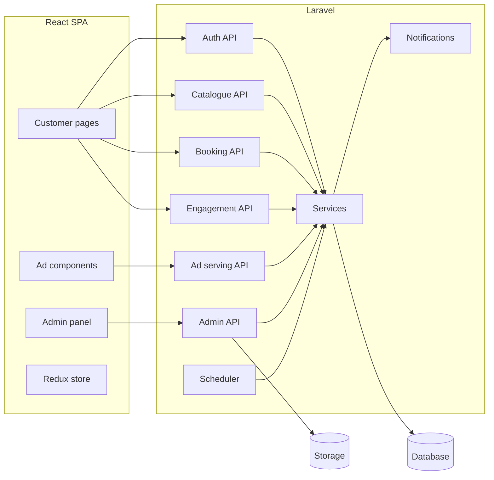
